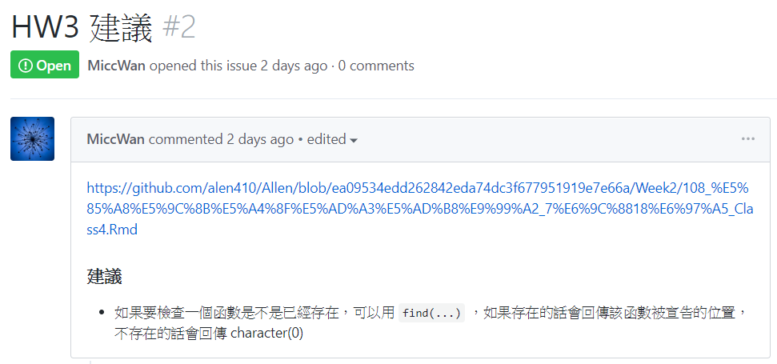
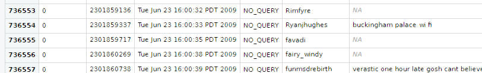
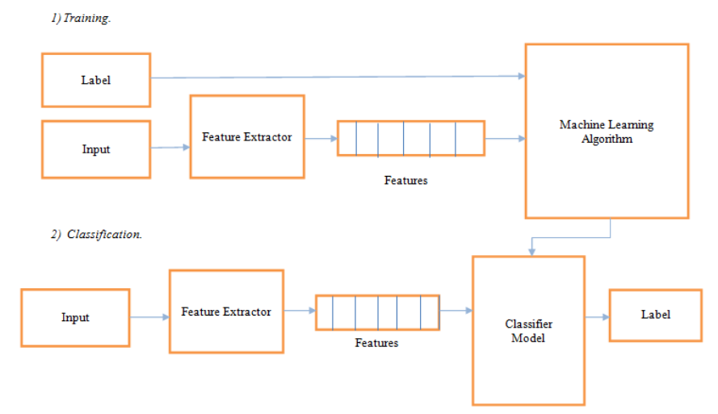

## Twitter sentiment analysis using R With Sentiment140 dataset
####資料集下載網址 http://help.sentiment140.com/for-students

#### 設置工作目錄，這屬於暫時性工作目錄，會依照檔案工作目錄變化來修改
```{r}
setwd("C:/Users/user/Documents/GitHub/National-Summer-Academy/Week3")
set.seed(1)

#install.packages("D:/CRAN/e1071_1.7-2.zip",
#                 repos = NULL,
#                 type = "win.binary")


library('NLP')
library('ROAuth')
library('RcppParallel')
library('caret')
library('data.table')
library('e1071')
library('foreach')
library('formatR')
library('futile.logger')
library('futile.options')
library('ggrepel')
library('glmnet')
library('iterators')
library('lambda.r')
library('mlapi')
library('stats')
library('stringr')
library('text2vec')
library('tidyverse')
library('tm')
library('twitteR')
library('klaR')
library('combinat')
library('questionr')
library('miniUI')
library('shiny')
library('purrrlyr')
library('wordcloud')
suppressMessages(library('dplyr')) 

```

#### 在R 3.6.1還是存在dplyr和stats等衝突，可以採用dplyr::filter直接指定使用
#### https://github.com/r-lib/rlang/issues/669

## 真的很謝謝助教替學生的作業解惑，助教真好❤!!
```{r}

```

### 可以成功查詢是否覆寫了
```{r}
find("find")
find("colnames")
find("bclust")
find("unused")
```


#### Sentiment140，來自Twitter上抓取下來帶有標籤(Label)的文字資料，資料筆數160萬筆。
#### 資料一共有6個欄位
#### 0 - 情緒面向 (0 = 負面情緒, 2 = 不帶情緒, 4 = 正面情緒)
#### 1 - 使用者的ID
#### 2 - 留言的日期
#### 3 - 全為NO_QUERY的資料
#### 4 - Twitter的使用者暱稱
#### 5 - 可能帶有情緒面向的留言


#### 文字前處理用function，移除標點符號，多餘的空格。
#### 先用find(...)確認要命名的函數名稱是否重複
```{r}
find("Text_preprocess")
```


#### find("Text_preprocess")回報為character(0)，代表可以使用該名稱
```{r}
Text_preprocess <- function(article) {
    article <- iconv(article, "UTF-8", "ASCII") #要先移除所有emoji
    article <- gsub(" ?(f|ht)(tp)(s?)(://)(.*)[.|/](.*)", "", article) #移除URL
    article <- gsub("\\$", "", article) # 移除錢號
    article <- gsub("\\n", "", article) # 移除換行符號
    article <- removeWords(article, stopwords("english"))
    article <- gsub("[[:punct:][:blank:][:digit:]]+", " ", article)
    article <-   trimws(article,
                        which = c("both", "left", "right")) #去除行初行尾空格
    article <- tolower(article) #該函數如果遇到emoji會出現utf8towcs錯誤
    return(article)
}
```

#### 參考資料:
#### https://stackoverflow.com/questions/9637278/r-tm-package-invalid-input-in-utf8towcs
#### https://stackoverflow.com/questions/25352448/remove-urls-from-string
#### 注意事項:由於資料量比較大，因此不建議使用tm_map()函數來進行文字清理。
#### 因為我的電腦比較老舊，CPU是i3-4150，RAM只有8GB，處理會很久很久。


#### 替原始資料加入欄位名稱(千萬不要用中文，會有BUG，請全程用英文)
#### 因為Sentiment140的label實在很亂，因此由原本的0,2,4改為0,0,1。
#### 其他不配合的資料全部剔除
#### 導入Sentiment140訓練資料集
```{r}
conv_fun <- function(x)
  iconv(x, "latin1", "ASCII", "")
training_data <- read_csv(
  "D:/Sentiment140/training.1600000.processed.noemoticon.csv",
  col_names = c('sentiment', 'id', 'date', 'query', 'user', 'text')
) %>% dmap_at('text', conv_fun) %>%
  mutate(sentiment = ifelse(sentiment == 0, 0, 1))

```


#### 文字前處理
```{r}
training_data$text <- Text_preprocess(training_data$text)
```

#### 英文用的停用詞
```{r}
stopwords(kind = "english")
```


#### 文字前處理後檢視資料發現有一些NA值在裡面，這種帶有標籤(label)卻沒有tweet的
```{r}

```

#### 必須要去除

#### 使用stats函式庫的complete.cases()來作清除
```{r}
training_data <- training_data[complete.cases(training_data),]

```

#### 參考資料:https://stackoverflow.com/questions/4862178/remove-rows-with-all-or-some-nas-missing-values-in-data-frame


#### 機器學習的典型流程
```{r}

```

#### 分割訓練用資料集與測試用資料集，80%用於訓練，20%用於測試
```{r}
trainIndex <- createDataPartition(
  training_data$sentiment,
  p = 0.8,
  list = FALSE,
  times = 1
)
tweets_train <- training_data[trainIndex,]
tweets_test <- training_data[-trainIndex,]
```


#### 定義文檔術語矩陣(document-term matrix)與分詞(tokenization)用的配置
```{r}
prep_fun <- tolower
tok_fun <- word_tokenizer

it_train <- itoken(
  tweets_train$text,
  preprocessor = prep_fun,
  tokenizer = tok_fun,
  ids = tweets_train$id,
  progressbar = TRUE
)

it_test <- itoken(
  tweets_test$text,
  preprocessor = prep_fun,
  tokenizer = tok_fun,
  ids = tweets_test$id,
  progressbar = TRUE
)
```

#### 建立詞彙表與文檔術語矩陣(document-term matrix)
```{r}
vocab <- create_vocabulary(it_train)
vectorizer <- vocab_vectorizer(vocab)
dtm_train <- create_dtm(it_train, vectorizer)
dtm_test <- create_dtm(it_test, vectorizer)
```


#### 文字雲
```{r}
wordcloud(
    words = vocab$term,
    freq = vocab$term_count,
    min.freq = 10,
    #會決定文字雲外觀的參數，要適當調整
    max.words = 100,
    #會決定文字雲外觀的參數，要適當調整
    random.order = FALSE,
    rot.per = 0,
    #要旋轉90度的比例，看個人喜好，設為0也可以
    colors = brewer.pal(12, "Paired"),
)
```


#### 建立TF-IDF物件
```{r}
tfidf <- TfIdf$new()
```

#### 將訓練用資料集與測試用資料集做TF-IDF的前處理篩選出獨特的詞彙
```{r}
dtm_train_tfidf <- fit_transform(dtm_train, tfidf)
dtm_test_tfidf <- fit_transform(dtm_test, tfidf)
dtm_train_tfidf@Dimnames[[2]]
```


#### 訓練機器學習模型
```{r}

# train the model
t1 <- Sys.time()
glmnet_classifier <- cv.glmnet(x = dtm_train_tfidf, y = tweets_train[['sentiment']], 
 family = 'binomial', 
 # L1 penalty
 alpha = 1,
 # interested in the area under ROC curve
 type.measure = "auc",
 # 5-fold cross-validation
 nfolds = 5,
 # high value is less accurate, but has faster training
 thresh = 1e-3,
 # again lower number of iterations for faster training
 maxit = 1e3)
print(difftime(Sys.time(), t1, units = 'mins'))
 
plot(glmnet_classifier)
print(paste("max AUC =", round(max(glmnet_classifier$cvm), 4)))
 
preds <- predict(glmnet_classifier, dtm_test_tfidf, type = 'response')[ ,1]
glmnet:::auc(as.numeric(tweets_test$sentiment), preds)
```


